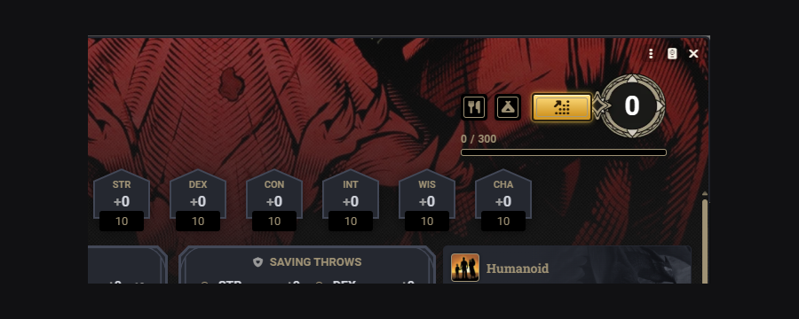
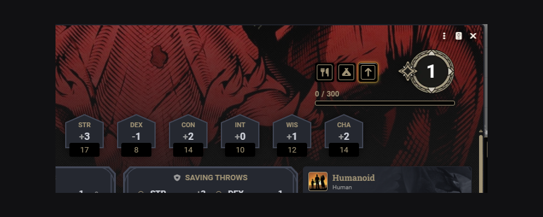
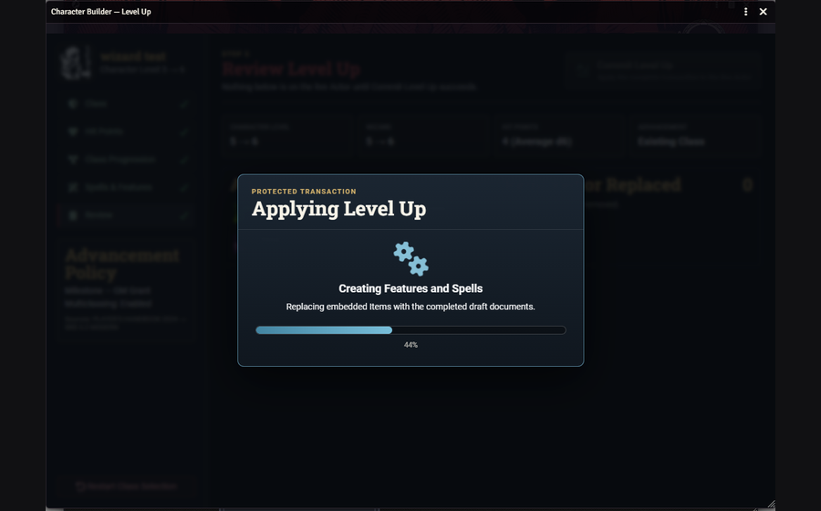

# Character Builder

**Character Builder** is a guided D&D 5e character creation, Level Up, multiclass, Epic Boon, and Character Keeper module for Foundry Virtual Tabletop 14 and D&D5e 5.3.3. It supports a Modern D&D progression policy and a source-authored 2014 progression policy.

It uses the official D&D5e documents and native Advancement system as its rules spine. Character Builder guides the choices, prepares them in drafts, validates the result, and commits the completed transaction to the live Actor.

  

## Compatibility

- Foundry VTT 14.364
- D&D5e 5.3.3
- Player's Handbook 2024 content package
- SRD 5.2 Modern
- SRD 5.1 Legacy and compatible 2014 compendiums through the Legacy progression mode
- Dynamically discovered third-party and world Item compendiums

## Installation

Install the module through Foundry's package browser, or use the manifest URL published on the module page.

For GitHub releases, the canonical release assets are:

- `module.json`
- `dnd5e-character-builder.zip`

Enable **Character Builder (DnD 5e)** in the world after installation.

## Quick Start — Game Master

1. Create or open a Player Character Actor.
2. Use the gold **Character Builder** button on an empty character sheet to begin guided creation.
3. Grant Level Ups individually from Actor controls or in groups through **Character Builder Tool**.
4. Configure content sources and campaign rules in **Character Builder Settings**.
5. Allow players to complete Level Ups and class maintenance from their own character sheets.

  

## Quick Start — Player

1. Open the Player Character Actor assigned to you.
2. Click the gold button to create an empty character.
3. When the GM grants a Level Up, use the Level Up arrow on the character sheet.
4. During Short or Long Rests, complete any optional class actions shown by Character Keeper, or continue the rest without changing anything.
5. Wizards receive a spellbook-management launcher for eligible scribing operations.

  

## In-Game Splash Tutorial

Character Builder includes a role-aware, multi-page tutorial that opens when each Foundry **User** first joins a world with the module active.

### Game Master guide

The GM tutorial covers:

- starting character creation from the gold sheet button;
- individual and batch Level Up grants;
- Character Keeper rest management;
- protected Actor transactions;
- content sources and module settings.

### Player guide

The player tutorial covers:

- starting an assigned empty character;
- recognizing a pending Level Up;
- optional Short and Long Rest management;
- Wizard spellbook tools when the user owns a Wizard Actor.

### Tutorial controls

Every user has an independent **Don't Show Splash Tutorial** preference stored on that Foundry User account. One user's choice does not affect another user, even when both accounts use the same browser.

The tutorial can be opened manually from:

**Settings → Character Builder Settings → Open Splash Tutorial**

Game Masters also receive **Show Splash Tutorial to Everyone Once**. This one-time action clears the suppression preference for every User and triggers the appropriate GM or player guide. Online users receive it when safe; offline users receive it the next time they log in.

## Guided Character Creation

Character creation includes:

- Character Name;
- Origins;
- Species and Subspecies;
- Background;
- Ability Scores and Background improvements;
- Class and class choices;
- Spell Selection;
- Starting Equipment and Shop;
- Review;
- protected Finish Character transaction.

Supported Ability Score methods include Point Buy, Standard Array, GM-defined Custom Array, rolled sets, and optional Manual entry.

The Starting Equipment Shop supports mundane level-1 equipment, exact quantities, containers, returns, source equipment, captured starting budgets, and configurable GM Bonus Gold. The Draft receives the GM bonus immediately, adds Class and Background currency as those documents are selected, and keeps that currency even when the player does not open or purchase from the Shop.

## Rules Progression Model

The GM chooses one world-level progression model:

- **Modern D&D (2024 / SRD 5.2):** subclass selection cannot occur before Class level 3. When an older Class document places its subclass choice at level 1 or 2, Character Builder moves that native ItemChoice Advancement to level 3. The native D&D5e workflow then delivers the subclass and all eligible subclass Advancements through level 3 together.
- **D&D 5th Edition (2014 / SRD 5.1):** preserves the levels authored in the selected Class and Subclass documents, including subclasses selected before level 3.

Character Builder changes only the Advancement schedule required by the selected policy. The actual selection and grants continue through the native D&D5e AdvancementManager.

## Level Up and Multiclass

The Level Up flow loads the Actor's current classes, features, spells, feats, equipment, proficiencies, historical choices, and managed ownership data.

It supports:

- advancing an existing class;
- adding a new class when multiclassing is allowed;
- class-level and total-character-level rules;
- native D&D5e Advancements;
- Hit Point advancement with locked roll protection;
- subclass choices;
- feature and spell replacements;
- class-owned and feature-owned spells;
- final review and protected commit.

### Feat and ASI +2 policy

The module distinguishes:

- **Feat:** every feat except the generic two-point Ability Score Improvement option, including feats that grant +1 to an Ability Score;
- **ASI +2:** only the generic Ability Score Improvement option that grants two points;
- **Epic Boon:** its own configured and level-gated category.

The native Advancement browser is not filtered or modified. Character Builder validates the completed choice on the draft and asks the player to choose again when the GM configuration does not authorize it.

## Character Keeper and Rest Management

Character Keeper opens before a Short or Long Rest only when the Actor has an optional supported action for that rest.

Examples include:

- Weapon Mastery maintenance;
- Circle of the Land changes;
- Replace Cantrip;
- Pact of the Tome and Warlock maintenance;
- Wild Shape form management;
- Spell Mastery changes;
- other class-specific routines supported by the current release.

The player may perform a change or continue the rest without changing anything. Normal D&D5e recovery, spell preparation, slots, uses, dice, effects, and runtime activities remain the responsibility of the D&D5e system.

  

## Wizard Spellbook Management

Eligible Wizards receive a spellbook-management launcher.

The scribing flow can:

- detect eligible written spells and Spell Scrolls;
- show cost, time, and configured Arcana-check requirements;
- explain failure consequences before confirmation;
- protect the final operation with a true modal transaction;
- prevent duplicate confirmation windows and multiple submissions.

  

## Epic Boon Gifts

When enabled, Game Masters can grant pending Epic Boons to eligible level-20 Player Characters through the same progression tools used for Level Ups.

Pending gifts can be revoked before redemption. Applied boons remain on the Actor even if future grants are disabled.

## Content Sources

Character Builder reads enabled compendia instead of rebuilding or cloning their catalogs.

The dedicated **Select Content Sources** screen scans active module, system, and world Item compendiums. Compatible packages appear automatically when they contain Classes, Subclasses, Features/Feats, Spells, Backgrounds, Species, weapons, equipment, consumables, tools, containers, or loot. The GM can enable sources and arrange their priority without relying on a fixed allowlist.

Examples include the Player's Handbook, Dungeon Master's Guide, SRD packages, third-party class/subclass modules, and world compendiums.

The GM can also configure:

- Modern D&D or D&D 5th Edition (2014) progression rules;
- Ability Score methods;
- Level Up mode;
- multiclass rules;
- Feat, ASI +2, and Epic Boon permissions;
- Starting Equipment Shop bonus gold;
- Hit Point advancement methods;
- Wizard scribing rules;
- tutorial display controls.

  

## Protected Transactions

Character Creation, Level Up, Multiclass, Epic Boon redemption, Keeper changes, and Scribe Spell commits use protected transaction flows.

While a commit or confirmation is active:

- background module windows cannot take focus;
- duplicate submits are blocked;
- confirmations remain in the foreground;
- draft changes are isolated from the live Actor;
- the interface is released only after success, cancellation, or a handled failure.

  

## Scope and Responsibility

Character Builder is responsible for delivering the Items, spells, features, effects, ownership, Advancements, flags, and resources required by the selected rules and choices.

After those resources are correctly present on the Actor, normal mechanical execution—activities, damage, targets, effects, consumption, recovery, and standard spell preparation—is handled by Foundry VTT and the D&D5e system.

## Support and Bug Reports

Report reproducible problems through the GitHub issue tracker:

`https://github.com/hammer-PvP/DnD-5e-Character-Builder/issues`

Useful reports include:

- Foundry and D&D5e versions;
- Character Builder version;
- class/subclass and current level;
- exact steps;
- screenshots;
- exported Actor JSON when the problem concerns Actor data.

## Changelog

See [CHANGELOG.md](CHANGELOG.md) for release notes.

## License and Credits

Copyright © Raphael Andrade.

See [LICENSE](LICENSE) for the complete license terms.
