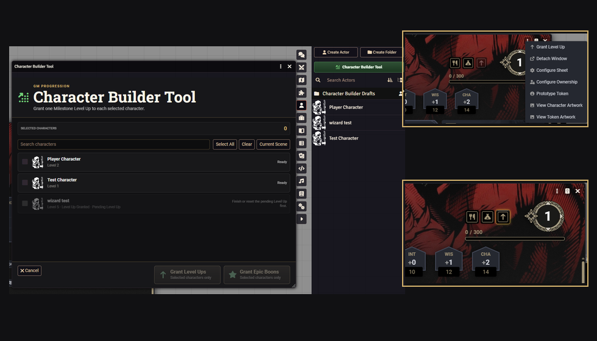
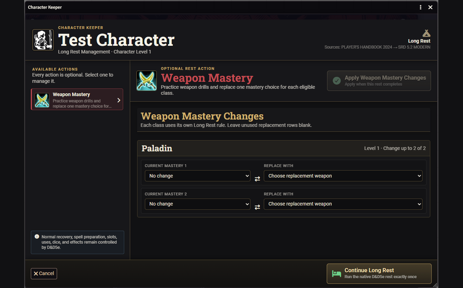
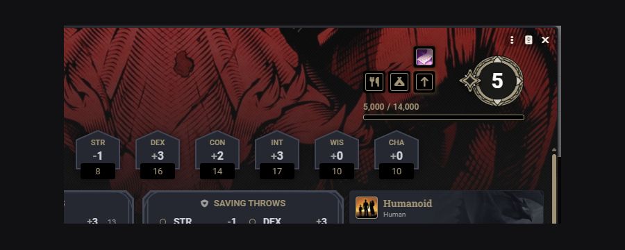
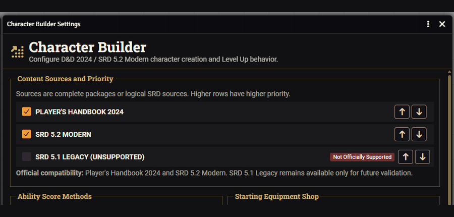

# Character Builder — Complete Manual

**Version:** 0.9.9x7a  
**Foundry VTT:** 14  
**D&D5e:** 5.3.3

This is the single user-facing manual shipped in the installable Character Builder module. The root `README.md` remains the GitHub overview; internal development protocols and duplicated documentation assets are intentionally not distributed to installed worlds.

---

# Character Builder

**Character Builder** is a guided D&D 5e character creation, Level Up, multiclass, Epic Boon, and Character Keeper module for Foundry Virtual Tabletop 14 and D&D5e 5.3.3. It supports a Modern D&D progression policy and a source-authored 2014 progression policy.

It uses the official D&D5e documents and native Advancement system as its rules spine. Character Builder guides the choices, prepares them in drafts, validates the result, and commits the completed transaction to the live Actor.

  

## Compatibility

- Foundry VTT 14.367
- D&D5e 5.3.3
- Player's Handbook 2024 content package
- SRD 5.2 Modern
- SRD 5.1 Legacy and compatible 2014 compendiums through the Legacy progression mode
- Dynamically discovered third-party and world Item compendiums

## Installation

Install the module through Foundry's package browser, or use the manifest URL published on the module page.

### Required dependency: libWrapper

Character Builder requires **libWrapper 1.13.5.1 or newer**. The dependency is declared in `module.json` with its official manifest URL, allowing Foundry to resolve and install it with Character Builder. A world cannot enable Character Builder while the required dependency is missing or inactive.

Official libWrapper project:

`https://github.com/ruipin/fvtt-lib-wrapper`

libWrapper coordinates the module's required D&D5e method wrapper with other packages and provides conflict diagnostics to the Game Master. Character Builder does not directly replace Foundry or D&D5e prototype methods.

For GitHub releases, the canonical release assets are:

- `module.json`
- `dnd5e-character-builder.zip`

Enable **Character Builder (DnD 5e)** in the world after installation.

This file is the complete user manual shipped with the module.

## Quick Start — Game Master

1. Create or open a Player Character Actor.
2. Use the gold **Character Builder** button on an empty character sheet to begin guided creation.
3. Grant Level Ups individually from Actor controls or in groups through **Character Builder Tool**. When the world uses native D&D5e Group Actors, choose the desired Party / Group in the Tool to limit batch actions to that group.
4. Optionally enable **GM-Managed Rest Availability** and grant or revoke Short or Long Rest access for selected characters from the same tool.
5. Configure content sources and campaign rules in **Character Builder Settings**.
6. Allow players to complete Level Ups and class maintenance from their own character sheets. Character Builder delegates protected Draft and safety-backup creation/cleanup to an active GM, so players do not need Foundry's global Create Actor or Delete Actor permissions for these workflows.

  

## Quick Start — Player

1. Open the Player Character Actor assigned to you.
2. Click the gold button to create an empty character.
3. When the GM grants a Level Up, use the Level Up arrow on the character sheet.
4. During Short or Long Rests, complete any optional class actions shown by Character Keeper, or continue the rest without changing anything. If the world uses GM-Managed Rest Availability, the corresponding native rest button glows only after the GM grants that rest.
5. Wizards receive spellbook-management assistance for eligible scribing operations and, from Wizard level 5, a Short Rest **Memorize Spell** swap inside Character Keeper. Eldritch Knights can open **Manage War Bonds** through the native Bond with Weapon Activity, and Fiend Warlocks can choose **Fiendish Resilience** through Character Keeper.

  

## In-Game Splash Tutorial

Character Builder includes a role-aware, multi-page tutorial that opens when each Foundry **User** first joins a world with the module active.

### Game Master guide

The GM tutorial covers:

- starting character creation from the gold sheet button;
- individual and batch Level Up grants;
- Character Keeper rest management;
- protected Actor transactions;
- content sources and module settings.

### Player guide

The player tutorial covers:

- starting an assigned empty character;
- recognizing a pending Level Up;
- optional Short and Long Rest management;
- Wizard spellbook tools when the user owns a Wizard Actor.

### Tutorial controls

Every user has an independent **Don't Show Splash Tutorial** preference stored on that Foundry User account. One user's choice does not affect another user, even when both accounts use the same browser.

The tutorial can be opened manually from:

**Settings → Character Builder Settings → Open Splash Tutorial**

Game Masters also receive **Show Splash Tutorial to Everyone Once**. This one-time action clears the suppression preference for every User and triggers the appropriate GM or player guide. Online users receive it when safe; offline users receive it the next time they log in.

## Guided Character Creation

Character creation includes:

- Character Name;
- Origins;
- Species and Subspecies;
- Background;
- Ability Scores and Background improvements;
- Class and class choices;
- Spell Selection;
- Starting Equipment and Shop;
- Review;
- protected Finish Character transaction.

Supported Ability Score methods include Point Buy, Standard Array, GM-defined Custom Array, rolled sets, and optional Manual entry. Standard, Custom, and rolled arrays use six positional slot tokens as a single source of truth. Selecting an occupied slot on another Ability moves it there and immediately returns the previous Ability to `— Select —`; the destination's former value is released rather than swapped. Every dropdown can also be cleared manually by selecting `— Select —`, and equal numeric results remain independent through unique positional slot IDs.

Confirmed creation steps remain reviewable. Returning to Ability Scores & Background, Species, Class, Spell Selection, or Starting Equipment does not discard anything and does not show a warning. A protected confirmation appears only when the player actually changes a confirmed option, including Shop purchases. After confirmation, the affected stage is unlocked, dependent choices are invalidated only when required, and the stage must be confirmed again before Character Creation can finish.

Character Creation Drafts are recovered by their source Actor after a reload. Character Builder also prevents multiple Builder windows for the same Actor and preserves duplicate Drafts for GM inspection instead of deleting potentially recoverable work.

The Starting Equipment Shop supports mundane level-1 equipment, exact quantities, containers, returns, source equipment, captured starting budgets, and configurable GM Bonus Gold. The Draft receives the GM bonus immediately, adds Class and Background currency as those documents are selected, and keeps that currency even when the player does not open or purchase from the Shop.

## Rules Progression Model

The GM chooses one world-level progression model:

- **Modern D&D (2024 / SRD 5.2):** subclass selection cannot occur before Class level 3. When an older Class document places its subclass choice at level 1 or 2, Character Builder moves that native ItemChoice Advancement to level 3. The native D&D5e workflow then delivers the subclass and all eligible subclass Advancements through level 3 together.
- **D&D 5th Edition (2014 / SRD 5.1):** preserves the levels authored in the selected Class and Subclass documents, including subclasses selected before level 3.

Character Builder changes only the Advancement schedule required by the selected policy. The actual selection and grants continue through the native D&D5e AdvancementManager.

## Level Up and Multiclass

The Level Up flow loads the Actor's current classes, features, spells, feats, equipment, proficiencies, historical choices, and managed ownership data.

When the world uses **Milestone** Level Ups, a GM grant also updates the Actor's numeric XP bookkeeping to at least the D&D5e threshold for the granted target level. Existing XP above that threshold is preserved. This does not change XP-mode progression; it only keeps Milestone characters ready for a later switch to XP tracking.

It supports:

- advancing an existing class;
- adding a new class when multiclassing is allowed;
- class-level and total-character-level rules;
- native D&D5e Advancements;
- Hit Point advancement with locked roll protection;
- subclass choices with an explicit native-document review step before continuing;
- feature and spell replacements;
- class-owned and feature-owned spells;
- final review and protected commit.

### Subclass review before continuing

When native D&D5e Advancement creates a new Subclass Item during Level Up, Character Builder deliberately remains on **Class Progression**. The selected subclass's own document supplies a richer review panel with its description, the features granted at the current Class level, and the source-authored Advancement progression at later Class levels. The player explicitly chooses **Continue Level Up** after reviewing the package; normal levels with no new subclass continue through the existing flow unchanged.

The review's **Full Details** button resolves the subclass's original content package and displays its dedicated source Journal page inside a Character Builder viewer when the source provides one. D&D5e's native subclass Journal rendering remains authoritative, including source art, editorial text, progression tables, and feature descriptions. Character Builder does not copy the book page into the module; it reads the active source at runtime. If no dedicated Journal page exists, Full Details falls back to the source Item description.

### Feat and ASI +2 policy

The module distinguishes:

- **Feat:** every feat except the generic two-point Ability Score Improvement option, including feats that grant +1 to an Ability Score;
- **ASI +2:** only the generic Ability Score Improvement option that grants two points;
- **Epic Boon:** its own configured and level-gated category.

The native Advancement browser is not filtered or modified. Character Builder validates the completed choice on the draft and asks the player to choose again when the GM configuration does not authorize it.

### Always Prepared spell ownership

Character Builder treats an Always Prepared grant as an additional ownership state of a spell, not as permission to leave two mechanically identical spell Items on the Actor.

During a new Character Creation or Level Up transaction, when a native Class, Subclass, or class-linked Feature grants a leveled spell that the same class already supplies through normal spell access, Character Builder keeps one canonical spell, promotes it to **Always Prepared**, preserves every acquisition owner, and redirects the native ItemGrant record to that canonical document. The Review still reports the feature that granted the spell.

For limited-list casters, a normally selected spell that becomes Always Prepared releases its former selection and the player must choose a replacement before committing the Level Up. Full-list casters receive the preparation-state change without an artificial extra choice.

**Paladin's Smite** remains a separate native Feature, while its native ItemGrant enriches the single canonical **Divine Smite** spell with Always Prepared status, the 1/Long Rest free-cast pool, and the forwarding Activities created by D&D5e. The original spell-slot Activities remain intact, so after the free cast is spent the same Divine Smite can still consume normal spell slots.

The merge is intentionally conservative. It requires the same canonical spell source and mechanically equivalent base Activities/effects. Non-mechanical metadata such as embedded-document timestamps is ignored. A native ItemGrant may contribute a use pool and free-cast forwarding Activities only when those additions are explicitly declared by that same ItemGrant; arbitrary spell modifications are still rejected. Spells from Items, different classes, casting abilities, or casting methods remain separate. Reconciliation is limited to the active Draft transaction and does not migrate existing Actors.

## Character Validation

Game Masters can right-click a Player Character in the Actor Directory and choose **Validate Character**. The tool always creates a revised copy first (`<Name> - Validated 1`, then `Validated 2`, `Validated 3`, and so on) and never modifies the original Actor. Revalidating a validation copy keeps the original character name and advances the validation number instead of stacking suffixes.

Character Validator is a secondary integrity and migration safety net, not a required completion step for Character Builder. A healthy character created and progressed entirely through Character Builder should normally require no Validator repairs; findings on such a character should be treated as evidence to audit the owning primary workflow rather than as a reason to rely on post-processing.

The Validator treats Character Builder data as read-only evidence: it may consult source snapshots, progression rules, choice badges, history, provenance, and canonical enabled sources, but it does not edit Character Builder settings, compendiums, registries, templates, or runtime rules. Repairs are limited to the revised Actor and are classified as deterministic restore, metadata/state reconciliation, guided native choice replay, or review-only when provenance is ambiguous.

Current validation includes structural Activity/Active Effect links, missing deterministic Advancement Items, stale copied Actor references, dependent Advancement completion, class/subclass grants, Weapon Mastery, Fighting Style, spell access/repertoire and grant ownership, malformed empty Spell placeholders, and source-accounted Traits such as skills, Expertise, saves, languages, tools, weapon/armor training, damage resistances/immunities/vulnerabilities, and condition immunities. Equipment, money, ammunition, current HP, spent spell slots, and spent resource amounts are intentionally outside scope.

## Character Keeper and Rest Management

After a successful native **Long Rest**, Character Keeper ends any remaining native concentration and performs a conservative transient-effect cleanup. Finite-duration/runtime effects are removed, while indefinite passive/source-derived effects and persistent conditions/custom effects are preserved unless their own data explicitly says they expire on a Long Rest.

Character Keeper opens before a Short or Long Rest only when the Actor has an optional supported action for that rest.

Examples include:

- rule-timed prepared-spell review at a Long Rest;
- Weapon Mastery maintenance;
- Circle of the Land changes;
- Replace Cantrip;
- Pact of the Tome and Warlock maintenance;
- Wild Shape form management;
- Spell Mastery changes;
- other class-specific routines supported by the current release.

The player may perform a change or continue the rest without changing anything. Normal D&D5e recovery, spell slots, uses, dice, effects, and runtime Activities remain the responsibility of the D&D5e system. Character Keeper only stages preparation or maintenance choices at a rules-authorized window and commits them after the authoritative rest succeeds.

### Long Rest Spell Preparation

Character Keeper offers **Prepare <Class> Spells** at a Long Rest only for classes whose 2024 preparation cadence permits that choice then: **Cleric, Druid, Paladin, and Wizard**. The world setting **Manage Long Rest Spell Preparation with Character Keeper** is enabled by default. While enabled, players make those ordinary preparation changes through Character Keeper and cannot prepare/unprepare the managed spells directly from the sheet; the GM and authorized Character Builder transactions remain unrestricted. Disabling the setting removes the Long Rest preparation action and restores manual player preparation. The prepared list is staged while reviewing the rest and is written to the Actor only after the native Long Rest actually completes. Cancelling D&D5e or Rest Recovery before completion leaves the live prepared list unchanged.

Each class is isolated on a multiclass Actor. Cleric, Druid, and Paladin review their own ordinary class spell Items; Wizard reviews only level 1+ Wizard spells actually present in that Wizard's spellbook. Cantrips are outside this interface. Always Prepared and other feature-granted spells are shown as locked context and do not count against the ordinary prepared-spell limit. Wizard Savant acquisitions remain ordinary spellbook spells and therefore remain valid preparation candidates.

Spell access and preparation timing are separate policies. **Ranger** still uses the full-list prepared-spell access model for ownership and numeric prepared-limit rules, but its preparation cadence is **Level Up**, so Ranger receives no Long Rest preparation action. Bard, Sorcerer, and Warlock likewise keep their Level Up preparation cadence. Wizard **Memorize Spell** is handled as its own Short Rest maintenance action: at Wizard level 5+, Character Keeper allows exactly one ordinary prepared level 1+ Wizard spell to be swapped for one other ordinary level 1+ spell already present in that Wizard spellbook. Cantrips and Always Prepared/feature-granted spells are excluded, and the total prepared count does not change.

### Runtime Feature Maintenance

Character Builder uses source-native D&D5e Items, Activities, Active Effects, and resource counters as the mechanical source of truth while supplying focused maintenance interfaces where the native lifecycle is incomplete or easy to mismanage.

- **Fighter — Eldritch Knight: War Bond.** Using the native **Bond with Weapon** Activity opens **Manage War Bonds** instead of the incomplete native chat-only maintenance loop. The manager reads the feature's native bond capacity, uses the native Enchant Activity to validate and apply eligible weapon bonds, allows bonds to be broken, and reconciles `uses.spent`. If a use remains spent after its bonded weapon is no longer present, the corresponding slot is shown as **Broken Bond** so the player can replace or release it deliberately. **Summon Weapon** remains fully native. The same manager is available from Character Keeper on a Short Rest.
- **Wizard — Memorize Spell.** On a Short Rest, eligible Wizards receive two scrollable spell lists: ordinary prepared Wizard spells and ordinary unprepared level 1+ spells already in that spellbook. Confirming requires one selection from each side and applies a strict 1-for-1 prepared-state swap after the native Short Rest completes.
- **Warlock — Fiend Patron: Fiendish Resilience.** On a Short or Long Rest, Character Keeper presents the damage-resistance choices from the Active Effects already embedded in the source-native feature Item. Confirming leaves exactly the selected native resistance Effect enabled and disables the other Fiendish Resilience choices.

### Rest Decision Assistance

For Short Rests, Character Keeper also surfaces optional decisions that are easy to miss but should not become a second rest engine. The action list is eligibility-driven: if a character has more than one supported decision, all applicable actions appear together; automatic recovery that needs no player decision is not duplicated.

- **Arcane Recovery** and Circle of the Land **Natural Recovery** share one spell-slot selection interface. It reads the Actor's actual derived level 1–5 spell-slot maximums, enforces the feature's combined-level budget, and consumes the native Item/Activity use tracker rather than creating a Character Builder resource.
- **Sorcerous Restoration** stages the player's intent and, only after the authoritative Short Rest succeeds, invokes the native **Restore Sorcery Points** Activity. D&D5e remains responsible for the formula and Font of Magic consumption.
- **Magical Cunning** is a direct shortcut to the native **Regain Pact Spell Slots** Activity. Because the rite is an independent feature use rather than a Keeper rest transaction, using it is not undone if the later Short Rest is cancelled.

### GM Party / Group filtering

**Character Builder Tool** uses D&D5e's native **Group** Actors rather than maintaining a second Character Builder Party roster. When one or more Groups exist, the Tool shows a **Party / Group** selector with **All Characters** plus one entry for every native Group. Selecting a Group restricts Character Builder batch operations to character-type members of that Group; NPCs and vehicles in the Group are ignored.

The same filter applies to batch Level Up grants, XP distribution, Epic Boon grants, and GM-managed Short/Long Rest availability. **Open Group** opens D&D5e's native Group sheet so the GM can add or remove members using the system's normal workflow. Character Builder does not require or change D&D5e's **Primary Party** setting. If the world has no Group Actors, the Tool simply keeps its previous behavior and lists all non-draft character Actors.

### Optional GM-Managed Rest Availability

The GM may enable **GM-Managed Rest Availability** when the campaign needs explicit control over who can rest—for example, when different groups are adventuring in different locations. With the setting enabled, native Short Rest and Long Rest buttons stay visible but locked until the GM grants the corresponding rest to selected characters from **Character Builder Tool**. The Tool automatically switches each rest control between Grant and Revoke: mixed selections are normalized to Granted first, while a selection in which every Actor already has that rest available can be revoked as a group. Short and Long Rest are independent permissions, and an available button is highlighted on the character sheet.

The player still starts the rest from their own native D&D5e button. Character Builder only gates availability; it does not implement a second rest engine. The grant is consumed after the native rest and Character Keeper finish successfully. Disabling the setting returns rests to normal unrestricted D&D5e behavior.

### Optional Player Character Sheet Integrity

The GM may enable **Player Character Sheet Integrity** to make protected Player Character sheets safer without forcing every table into the same restrictions. It is disabled by default. The Settings screen provides **Configure Integrity Rules**, where the GM can enable or disable six broad structural protection packages independently: **Character Data & Proficiencies**, **Inventory & Item Editing**, **Character Content & Progression**, **Resources & Spell Slots**, **Currency**, and **Prepared Spell Limit**. Turning the master switch off pauses the protections without erasing the individual choices.

A separate **Allow Casting Unprepared Spells** policy is visible directly in Character Builder Settings and in Configure Integrity Rules. It controls casting only; it does not decide whether the player may edit the prepared list:

- **On:** Character Builder allows ordinary level 1+ unprepared spells to be cast normally.
- **Out of Combat Only:** unprepared spells may be cast outside combat, but a started Combat requires the spell to be prepared.
- **Off:** ordinary level 1+ unprepared spells cannot be cast inside or outside combat.

This casting policy requires the Player Character Sheet Integrity master switch. Preparation editing is governed separately by **Manage Long Rest Spell Preparation with Character Keeper**. Therefore a GM can disable Keeper preparation to restore manual sheet preparation while still choosing any unprepared-casting policy.

The authoritative usage check runs at D&D5e's pre-Activity boundary, before the normal usage/upcast dialog and before slot/resource consumption. This means sheet controls, hotbar use, and macros cannot bypass the selected policy while normal Activity configuration for a legal spell remains untouched. With casting set to **Off**, Wizard **Ritual Adept** preserves its rules exception outside combat: an unprepared ritual-tagged Wizard spell in that Wizard's spellbook is allowed as the slot-free, non-upcast ritual exception. The exception never applies in combat and a spell merely having a `ritual` casting method is not enough to bypass the policy.

The **Prepared Spell Limit** package remains a separate numeric integrity rule. When activated, excess ordinary prepared spells are automatically unprepared from the highest spell level downward; ties are removed from the bottom of the current ordering first. Always Prepared and feature-granted spells are excluded. A legal attempt to prepare beyond the class limit is rejected until another ordinary spell is unprepared. Full-list access, spellbook access, limited repertoire, and the timing at which a class may change preparation are deliberately modeled as separate concerns.

With protections enabled, players can still **Use / Cast** legal Items and Activities, **Equip / Unequip**, **Attune / Unattune**, favorite entries, expand descriptions, break their own concentration through the native D&D5e control, and manually reorder Items/spells already on the same Actor. Native D&D5e consumption, rest recovery, Currency Manager Convert/Transfer, and Item Piles/API inventory transfers remain available. Structural restrictions remain UI-path based rather than a global Document-update/create/delete block, while Allow Casting Unprepared Spells intentionally uses the D&D5e Activity hook as its gameplay authority. GM actions and authorized Character Builder/Level Up transactions remain outside the player guard.

### Optional Rest Recovery 5e compatibility

When **Rest Recovery 5e** is active, Character Builder detects it automatically. Character Keeper still stages and validates its own rule-authorized maintenance choices first, then hands the actual Short/Long Rest back to D&D5e. Arcane Recovery and Natural Recovery selections are prepared immediately before that handoff so their native use tracker is already spent and an external rest provider cannot apply the same feature a second time. If Rest Recovery opens its workflow, Character Builder waits for the authoritative `dnd5e.restCompleted` event before applying remaining Keeper post-rest changes and consuming any GM rest grant. Cancelling the Rest Recovery window restores the exact pre-rest spell-slot values and native recovery tracker, keeps the Keeper choices staged, and returns control to the pending session. No compatibility setting is required, and Character Builder does not import or reproduce Rest Recovery's HP, Hit Dice, food/water, exhaustion, or variant-rest rules.

### Optional Half Long-Rest Recovery on Short Rest

The GM may enable an optional homebrew rule named **Half Long-Rest Recovery on Short Rest**. It is disabled by default, so installing or updating Character Builder does not change any campaign's rest rules.

After one native Short Rest completes, the optional layer restores `floor(maximum / 2)` of each eligible Long-Rest-only reserve, limited by the amount currently missing or spent. Normal spell slots, Long-Rest-only Actor resources, Item uses, and Activity uses can qualify. HP, Hit Dice, temporary HP, Death Saves, Exhaustion, spell preparation, Long-Rest effect expiry, consumables, dawn/day recovery, Pact Magic, and resources that already recover on a Short Rest are excluded.

The separate **Short Rest Homebrew Cooldown** setting uses Foundry server time and defaults to 5 minutes. It restricts only the additional homebrew recovery; the native Short Rest always continues normally. A value of 0 permits the homebrew layer on every completed Short Rest while transaction locks and rest-session idempotency still prevent duplicate clicks. Every applied recovery, cooldown result, or no-resource result is written to chat for auditing.

  

## Rules Assistance

Character Builder includes an optional GM-controlled runtime layer named **Rules Automation Assistance**. It is disabled by default and is intended to help newer players avoid missing deterministic passive bonuses and effects that the D&D5e system does not fully apply on its own.

The Settings screen provides a master switch plus **Configure Assistance Rules**, where the GM can enable or disable each supported rule independently. Turning the master switch off pauses every assistance without erasing the individual choices, so a world can disable only the rules already covered by another automation module.

The current rule list includes:

- Great Weapon Fighting;
- Thrown Weapon Fighting;
- Cleric — Blessed Strikes: Potent Spellcasting;
- Druid — Elemental Fury: Potent Spellcasting;
- Wizard — Empowered Evocation;
- Bard — Bardic Inspiration hidden-outcome-safe post-roll choice and consumption;
- Mage Armor Effect Application, including Armor of Shadows;
- Agonizing Blast Native Binding;
- Paladin — Lay on Hands: Remove Poison;
- Contextual Roll Modifiers;
- Source-to-Target Damage Riders (Hunter's Mark / Hex);
- Bard — Cutting Words manual reaction assistance;
- Concentration & Dependent Effects;
- Temporary Transformation Actor Cleanup;
- Summon Profile Level Guard;
- Weapon Mastery Chat Assistance.

Roll-modifier assistance uses native D&D5e roll hooks and changes only the current roll configuration. Weapon Mastery damage assistance posts specialized native D&D5e `DamageRoll` messages from the source weapon without permanently editing its formula. Effect assistance reuses the native Active Effect already supplied by the source spell or feature. Rules Assistance never creates duplicate weapons, duplicate spells, duplicate Activities, replacement chat commands, or permanent formula edits.

Bardic Inspiration assistance runs only when an official native Bardic Inspiration effect is already present, but its player-facing decision is intentionally **not conditioned on hidden success or failure**. Every eligible attack roll, ability check, skill check, tool check, or saving throw receives the same compact **Use / Keep** decision while the effect remains available. The player sees the roll total and Inspiration die only; AC, DC, Success, and Failure remain private to D&D5e's normal GM adjudication. The transparent decision has no visual blur, remains draggable and on top, and functionally blocks other actions until resolved. The original Bardic Inspiration use is not spent again. Effects originating from Items remain under the Item Creator runtime.

When the die is used, the public assistance message reports only the original total, bonus, and resulting total. Character Builder sends the GM a separate private resolution containing the hidden target/success information when it is available.

Post-roll providers can coordinate through `game.modules.get("dnd5e-character-builder").api.rollResolutionQueue`. Protocol v2 preserves `Symbol.for("dnd5e.roll-resolution-queue.v1")` for compatibility while adding explicit `markPending`, `finalize`, `getResolution`, and `waitForFinalized` methods. Native resolution finishes first, Character Builder uses phase `character` (priority 200), and item runtimes use phase `items` (priority 300). The structured queue may retain `target` and `succeeded` internally for coordination and GM-side resolution, but providers must never use a hidden outcome to decide whether a player-facing prompt appears.

Mage Armor is applied automatically to one eligible target after a successful use. The target cannot be wearing equipped light, medium, or heavy body armor; clothing and shields do not block the effect. A repeated cast refreshes the existing native effect instead of stacking another copy, and equipping body armor ends Mage Armor. Armor of Shadows always resolves to the Warlock using the Invocation.

Agonizing Blast uses Character Builder's managed Invocation target to apply and maintain the official PHB enchantment on the selected cantrip. The native enchantment supplies the visible `, Agonizing` suffix and the dynamic `@abilities.cha.mod` damage bonus. Its reconciliation is event-driven rather than a polling loop and can be disabled independently from the other assistance rules.

**Weapon Mastery Chat Assistance** enriches the native D&D5e attack Activity card rather than creating a replacement card. Eligibility comes from the originating Actor's native `WeaponData.masteryOptions`; when D&D5e offers multiple mastery options, the assistance follows the mastery recorded on the actual attack roll instead of assuming the weapon's printed default. Every supported mastery is represented by a compact native content link to the D&D5e mastery reference. Graze adds a contextual damage button only after a provable miss, Cleave adds a specialized weapon-damage button alongside the native Attack/Damage controls, and Topple may display only its final calculated DC. Vex, Sap, Nick, Push, and Slow remain link-only. The service creates no persistent target, turn, distance, or Action Economy state.

Lay on Hands `Remove Poison` waits for the native Activity to complete and spend its normal 5-point cost, then removes only the native `Poisoned` status from the single recorded target. It never searches for or deletes unrelated Active Effects.

**Contextual Roll Modifiers** are source-agnostic and ephemeral. Active Effects may declare a formula, advantage, or disadvantage that applies to rolls made by their owner or to incoming rolls against their owner. The runtime evaluates the declaration against the current roll and target and never writes the modifier permanently onto the attacker, weapon, or Actor. Blade Ward 2024 is the first incoming-roll adapter: while its concentration-bound effect is active on the caster, an attack made against that caster receives `-1d4` on that attack roll. Save-gated debuffs can use the same runtime after their effect is applied to a target. No target selected means no incoming modifier is guessed.

**Source-to-Target Damage Riders** extend contextual automation to damage that exists because a specific source Actor has marked or cursed a specific target. The runtime resolves the controller from the target effect, requires that controller to be the current attacker and that target to be the single selected target, then appends the source document's own Damage Activity to the native Attack damage process. Hunter's Mark uses `Bonus Mark Damage`, upgrading to Foe Slayer's native improved Activity when present; Hex uses `Bonus Hex Damage`. The formulas and damage types remain source-authored rather than hard-coded into weapons. Hunter's Mark keeps the native validated application path. Hex uses a focused compatibility path because D&D5e 5.3.3 can create the usage message without exposing a usable Effects tray in this workflow: after a Hex utility Activity that declares the six curse effects is used, Character Builder presents those same source-authored `Hexed Strength/Dexterity/Constitution/Intelligence/Wisdom/Charisma` choices, applies the selected native Active Effect to the single recorded target, and binds it to the live D&D5e concentration effect. Character Builder does not recreate the disadvantage mechanic or the `1d6` damage formula.

**Cutting Words** remains a manual Bard decision. The Bard targets a hostile roller to reduce that creature's most recent eligible D20 roll, or targets a friendly recipient to arm a reduction against the latest pending damage message. For hostile/D20 targets, the Recent Roll Registry prefers the shared queue's finalized `currentTotal`, so later Item-origin modifiers already resolved by the queue are included exactly once before Cutting Words subtracts its die. The public handoff never includes hidden AC/DC or success/failure state. The damage mode uses the campaign-approved simplified order: D&D5e first calculates its normal final damage, then Cutting Words subtracts the Bardic die immediately before HP/temporary HP are changed. No automatic success-sensitive prompt appears. Cutting Words consumes the same native Bardic Inspiration reserve used by the normal Inspiration Activity.

Character Builder also exposes a versioned **Resource Consumption Event** after D&D5e finishes native Activity consumption. Consumers can subscribe through `api.resourceEvents` to learn which reserve actually changed and which Item/Activity caused it. This deliberately does not mean that a Bardic Inspiration effect was granted to a target.

**Concentration & Dependent Effects** keeps D&D5e authoritative for concentration documents and target-effect cleanup. A Concentration roll is kept pending until the shared post-roll queue reaches its final total, including Character Builder and Item-origin providers. If the final result still fails, Character Builder leaves concentration active and posts a GM decision card in Chat. **Keep Concentration** preserves the current state; **Drop Concentration** calls the native `Actor.endConcentration()` API, after which D&D5e removes dependent effects normally. Character Builder also corrects the native concentration-request edge case where clicking a whispered DC request while another non-concentrating Actor is targeted would otherwise roll that wrong Actor. Non-concentration effects remain unaffected.

**Managed Summons** runs after native D&D5e Summon Activities and materializes finalized summons as linked managed Actors without changing native summon count, placement, profiles, attacks, AC, PB, damage, or concentration rules. Managed Actors inherit ownership from the summoning Actor, may be organized in per-character `<FirstName> - Companions` folders, and are tracked by summoner, source, and summon instance. Source policies can add lifecycle rules such as the Ranger Primal Companion's exclusive active companion. Concentration-bound managed summons are cleaned up only after D&D5e confirms that concentration has actually ended.

**Temporary Transformation Actor Cleanup** completes the native D&D5e revert lifecycle when a player, rather than a GM, cancels a transformation. After D&D5e has restored the original character/token state, the active GM removes only temporary Actor documents whose native transformation flags prove they belong to that original Actor's transformation chain. The cleanup is generic to native transformations and never identifies Actors by creature name, type, folder, or ownership. Original character Actors and source-form Actors are never deleted by this rule.

**Save-Gated Effect Application** reuses D&D5e's native Effects tray instead of auto-applying a debuff from a hidden save result. For supported compatibility adapters, Character Builder ensures the source Activity exposes a non-transfer effect profile in the usage card. The tray is visible to the GM, who applies the effect only to targets that actually failed. D&D5e then creates the target Active Effect and, for a concentrated source, automatically binds it to the concentration through `flags.dnd5e.dependentOn`. Bane 2024 is the first regression adapter. If the official Item already contains a mechanical Bane effect, Character Builder links that native effect rather than adding a duplicate modifier; only a missing/empty effect profile receives the generic contextual fallback.

For cross-module effects, Character Builder exposes `api.contextualRollModifiers` and `api.contextualEffects`. External runtimes can register a contextual-effect provider or create/bind an effect to a lifecycle without depending on spell names. The shared protocol symbol is `Symbol.for("dnd5e.contextual-roll-modifiers.v1")`.

Rules Automation Assistance works most reliably with characters created, leveled, and maintained through Character Builder and Character Keeper. Manually created characters remain supported whenever the required native data can be identified, but managed bindings and automatic reconciliation may be limited.

## Wizard Spellbook Management

Eligible Wizards receive a spellbook-management launcher.

The scribing flow can:

- detect eligible written spells and Spell Scrolls;
- show cost, time, and configured Arcana-check requirements;
- explain failure consequences before confirmation;
- protect the final operation with a true modal transaction;
- prevent duplicate confirmation windows and multiple submissions.

  

## Epic Boon Gifts

When enabled, Game Masters can grant pending Epic Boons to eligible level-20 Player Characters through the same progression tools used for Level Ups.

Pending gifts can be revoked before redemption. Applied boons remain on the Actor even if future grants are disabled.

## Content Sources

Character Builder reads enabled compendia instead of rebuilding or cloning their catalogs.

The dedicated **Select Content Sources** screen scans active module, system, and world Item compendiums. Compatible packages appear automatically when they contain Classes, Subclasses, Features/Feats, Spells, Backgrounds, Species, weapons, equipment, consumables, tools, containers, or loot. The GM can enable sources and arrange their priority without relying on a fixed allowlist.

Examples include the Player's Handbook, Dungeon Master's Guide, SRD packages, third-party class/subclass modules, and world compendiums.

A complete description of every setting, its default, scope, dependencies, and Actor impact is included in [the complete manual](#settings-reference).

The GM can also configure:

- Modern D&D or D&D 5th Edition (2014) progression rules;
- Ability Score methods;
- Level Up mode;
- multiclass rules;
- Feat, ASI +2, and Epic Boon permissions;
- Starting Equipment Shop bonus gold;
- Hit Point advancement methods;
- Wizard scribing rules;
- optional GM-managed Short/Long Rest availability;
- optional half Long-Rest recovery on Short Rest and its server-time cooldown;
- optional deterministic dice assistance;
- tutorial display controls.

### Restore Current Version Defaults

Character Builder Settings includes the GM-only **Restore Current Version Defaults** maintenance action. It replaces the module's world configuration with the defaults declared by the installed version and refreshes discovered content sources.

The reset never deletes or modifies Actors, Items, levels, progress records, transactions, Drafts, progression ledgers, Scenes, or campaign data. A protected modal requires the GM to type `RESET`. The optional **Also reset individual user preferences** choice clears per-user tutorial suppression and tutorial revision state; the separate tutorial broadcast action remains independent.

  

## Protected Transactions

Character Creation, Level Up, Multiclass, Epic Boon redemption, Keeper changes, and Scribe Spell commits use protected transaction flows.

While a commit or confirmation is active:

- background module windows cannot take focus;
- duplicate submits are blocked;
- confirmations remain in the foreground;
- draft changes are isolated from the live Actor;
- the interface is released only after success, cancellation, or a handled failure.

  

## Compatibility Hardening

Character Builder is designed for worlds that may run many other modules in the same browser context.

The current compatibility policy includes:

- libWrapper-managed interception instead of direct prototype replacement;
- concrete type checks before collection access;
- no reliance on non-standard `Array.prototype.first()` or similar convenience extensions;
- module-prefixed Handlebars helpers and Application classes;
- a namespaced public API at `game.modules.get("dnd5e-character-builder").api`;
- the legacy `game.characterBuilder` alias retained for existing beta macros;
- native Application close hooks retained as a fallback for protected Advancement cleanup.

These protections reduce conflicts, but Foundry modules still share one JavaScript environment. Reproducible compatibility reports should include the complete active-module list.

See the [complete manual](#compatibility-and-conflict-reports) for compatibility notes and the conflict-report checklist.

## Scope and Responsibility

Character Builder is responsible for delivering the Items, spells, features, effects, ownership, Advancements, flags, and resources required by the selected rules and choices.

After those resources are correctly present on the Actor, normal mechanical execution—activities, damage, targets, effects, consumption, recovery, and standard spell preparation—is handled by Foundry VTT and the D&D5e system.

## Support and Bug Reports

Foundry **Game Settings** includes a separate **Support the Creator** row with a **Buy Me a Coffee** button. Support/cross-promotion is intentionally kept outside the functional Character Builder Settings window.

Report reproducible problems through the GitHub issue tracker:

`https://github.com/hammer-PvP/DnD-5e-Character-Builder/issues`

Useful reports include:

- Foundry and D&D5e versions;
- Character Builder version;
- class/subclass and current level;
- exact steps;
- screenshots;
- exported Actor JSON when the problem concerns Actor data;
- complete active-module list when the stack includes another package or a generated `Bundle.js` file.

## Changelog

See [CHANGELOG.md](CHANGELOG.md) for release notes.

## License and Credits

Copyright © Raphael Andrade.

See [LICENSE](LICENSE) for the complete license terms.

---

# Settings Reference

This reference documents every visible Character Builder setting in v0.9.9x7a. Unless stated otherwise, settings are **world settings**, can be changed only by a Game Master, and do not require a server restart. Saving the settings window affects future Character Creation, Level Up, Character Keeper, or runtime-assistance operations; it does not retroactively delete character content.

## Splash Tutorial

### Don't Show Splash Tutorial

- **Scope:** Client/user preference.
- **Default:** Off.
- **Enabled:** The tutorial does not open automatically for that user. It can still be opened manually.
- **Disabled:** The tutorial may open according to the current tutorial revision.

### Show Splash Tutorial to Everyone Once

- **Scope:** One-time GM action, not a persistent toggle.
- **Effect:** Clears suppression for online users immediately and schedules the current tutorial revision for offline users at their next login.
- **Actor impact:** None.

## Content Sources

### Select Content Sources

- **Scope:** World.
- **Default:** Installed PHB 2024 and SRD 5.2 sources are enabled; SRD 5.1 is disabled.
- **Effect:** Controls which active module, system, and world Item compendiums supply Classes, Subclasses, Features, Feats, Spells, Backgrounds, Species, and equipment.
- **Disabled source:** Existing Actor content is not removed. The source is excluded from new Builder searches and choices.
- **Priority:** Higher-priority enabled sources win when equivalent content must be resolved.
- **Reload:** Not normally required.

## Rules Progression Model

### Rules Generation

- **Scope:** World.
- **Default:** Modern D&D (2024 / SRD 5.2).
- **Modern D&D:** Holds subclass selection until Class level 3 and normalizes older Class documents whose subclass choice was authored at level 1 or 2. Native D&D5e Advancement remains responsible for the actual selection and grants.
- **D&D 5th Edition (2014):** Preserves the levels authored in the selected Class and Subclass documents.
- **Actor impact:** A policy normalization pass updates only the structural subclass-choice level. Live Advancement values, Weapon Mastery, proficiencies, ItemGrant records, and ASI/Feat choices are preserved.
- **Conflict risk:** Modules that independently rewrite Class Advancement schedules may conflict.

## Ability Score Methods

At least one method must remain enabled.

### Point Buy

- **Default:** On.
- **Enabled:** Players can use the standard point-buy workflow.
- **Disabled:** Point Buy is removed from new Character Creation choices.

### Standard Array

- **Default:** On.
- **Enabled:** Players can assign the standard six values.
- **Disabled:** Standard Array is removed from new Character Creation choices.

### Custom Array

- **Default:** Off.
- **Enabled:** Players can assign the six GM-configured positional slots.
- **Disabled:** The saved six values remain stored but are not offered.
- **Values:** Each slot must be a whole number from 1 to 20. Equal numbers remain distinct slots.

### Roll

- **Default:** On.
- **Enabled:** Players can generate rolled sets.
- **Disabled:** Rolled Ability Scores are not offered.

### Manual Entry

- **Default:** Off.
- **Enabled:** Players can enter Ability Scores manually.
- **Disabled:** Manual entry is not offered.
- **Risk:** Enabling manual entry intentionally gives the player freedom outside the automated point/array limits.

### Roll Mode

- **Default:** Limited Rolls, 2 complete sets.
- **Single Roll:** Exactly one complete set.
- **Limited Rolls:** Allows the configured number of complete sets, including the first.
- **Unlimited Rolls:** Does not impose a set limit.
- **Actor impact:** Only new or currently edited creation Drafts are affected.

## Starting Equipment Shop

### Shop Bonus Gold

- **Scope:** World.
- **Default:** 0 GP.
- **Effect:** Adds the configured GP to a Character Creation Draft as soon as creation begins. The currency remains available whether or not the Shop is opened.
- **Disabled equivalent:** Set to 0.
- **Existing Actors:** Not changed.

## Level Up Availability

### Advancement Method

- **Default:** Milestone — GM Grant Required.
- **Experience Points:** Level Up becomes available at the next total-character-level XP threshold.
- **Milestone:** A GM must grant Level Up for that Actor.
- **Actor impact:** Changes availability only; it does not alter existing levels or XP.

### Level Up Ready Sound

- **Scope:** World, GM-only.
- **Default:** Empty (no sound).
- **File selection:** Uses Foundry's native audio File Picker; the Test button plays locally without saving.
- **Channel:** Foundry **Interface Sounds**, so each user's Interface volume controls playback.
- **XP mode:** Plays only when an Actor crosses from below to at-or-above the next character-level XP threshold. Remaining above the threshold or unrelated Actor updates do not replay the cue.
- **Milestone mode:** Plays only when a previously unavailable GM Level Up grant becomes available.
- **Recipients:** The cue is broadcast to active non-GM users explicitly owning or assigned to that Actor; the initiating client also receives Foundry's local one-off playback.

### Enable Multiclass

- **Default:** On.
- **Enabled:** Players may add a new Class during Level Up.
- **Disabled:** Only existing Classes may be advanced. Existing multiclass Actors are not modified.

### Enforce Multiclass Requirements

- **Default:** On.
- **Dependency:** Has effect only when Enable Multiclass is on.
- **Enabled:** Applies the configured official prerequisite model.
- **Disabled:** Allows authorized multiclass selection without prerequisite enforcement.

### Enable Feats

- **Default:** On.
- **Enabled:** Allows optional Feat choices, including Feats that grant a +1 Ability Score increase.
- **Disabled:** Optional Feat selections are rejected after the native browser closes. Mandatory source grants and existing Feats remain unchanged.

### Enable Ability Score Improvement

- **Default:** On.
- **Enabled:** Allows the generic two-point Ability Score Improvement choice.
- **Disabled:** The generic ASI +2 route is rejected. Feat-granted +1 increases remain governed by Enable Feats.

### Enable Epic Boons

- **Default:** On.
- **Enabled:** Allows optional Epic Boon choices when otherwise eligible.
- **Disabled:** New optional Epic Boon choices are blocked. Existing Epic Boons are never removed.

### Enable Grant Epic Boons

- **Default:** Off.
- **Dependency:** Requires Enable Epic Boons.
- **Enabled:** Gives the GM controls to grant pending Epic Boon choices to eligible level-20 Player Characters.
- **Disabled:** New grants are unavailable; already applied boons remain.

## Character Keeper — Wizard Scribing

### Allow Spell Scroll Scribing

- **Default:** On.
- **Enabled:** Eligible Wizards can copy written spells and Spell Scrolls through Character Keeper.
- **Disabled:** The Keeper scribing launcher is unavailable. Existing spellbook entries are not changed.

### Charge Wizard Scribing Costs

- **Default:** On.
- **Enabled:** Deducts the configured official 50 GP per spell level.
- **Disabled:** The checkout still reports the rules cost but charges 0 GP.

### Require Arcana Check for Spell Scroll Scribing

- **Default:** On.
- **Enabled:** Requires a public Intelligence (Arcana) check against DC 10 + spell level.
- **Disabled:** A confirmed eligible attempt succeeds automatically.

### Charge Scribing Cost on Failed Check

- **Default:** On.
- **Dependency:** Relevant only when the Arcana check is required.
- **Enabled:** A failed check consumes the Spell Scroll and charges the GP cost.
- **Disabled:** A failed check consumes the Spell Scroll but preserves currency.

## Character Keeper — Long Rest Spell Preparation

### Manage Long Rest Spell Preparation with Character Keeper

- **Scope:** World, GM-only.
- **Default:** **On**.
- **Enabled:** Cleric, Druid, Paladin, and Wizard ordinary level 1+ preparation is handled through Character Keeper at Long Rest. Players cannot prepare or unprepare those managed spells directly from the Actor sheet.
- **Disabled:** Character Keeper no longer offers the Long Rest preparation action and players regain normal manual preparation controls.
- **GM:** GM sheet edits remain allowed in either state.
- **Authorized transactions:** Character Creation, Level Up, Character Keeper commits, grants, and other Character Builder-authorized updates bypass the player guard.
- **Commit timing:** Keeper selections remain staged until the authoritative Long Rest finishes; cancelling D&D5e or Rest Recovery leaves the live prepared list unchanged.
- **Class cadence:** Ranger, Bard, Sorcerer, and Warlock do not gain Long Rest preparation from this option because their ordinary preparation/repertoire timing is Level Up.
- **Review tools:** The spell search/filter toolbar stays visible while scrolling long spell lists. **All** shows the ordinary preparation pool; **Prepared** shows only currently selected ordinary prepared spells and updates immediately as selections change.

## Character Builder Tool — Party / Group filtering

- **Source of truth:** Native D&D5e **Group** Actors and their native membership. Character Builder does not store a parallel Party roster.
- **When Groups exist:** Character Builder Tool offers **All Characters** plus each native Group in its Party / Group selector.
- **When no Groups exist:** The Tool lists all non-draft character Actors, matching the pre-x6 behavior.
- **Filtered operations:** Level Up grants, XP distribution, Epic Boon grants, and GM-managed Short/Long Rest availability act only on character-type members visible through the selected Group. NPC and vehicle members are ignored.
- **Membership editing:** **Open Group** opens the native D&D5e Group sheet; add/remove members there.
- **Primary Party:** Not required and not modified by Character Builder. Multiple Groups can be used independently.

## Character Keeper — GM-Managed Rest Availability

### GM-Managed Rest Availability

- **Scope:** World, GM-only.
- **Default:** **Off**.
- **Disabled:** Character Builder does not restrict Short Rest or Long Rest. Native D&D5e behavior remains authoritative.
- **Enabled:** Native Short Rest and Long Rest buttons remain visible on completed Player Character sheets but are disabled until the GM grants the matching rest from **Character Builder Tool**.
- **Grant/Revoke scope:** The Tool acts only on the characters currently selected by the GM. Short Rest and Long Rest availability are stored independently per Actor. If none or only some selected Actors currently have a rest grant, the control is **Grant** and normalizes all selected Actors to available. If every selected Actor already has that rest grant, the control becomes **Revoke** and removes it from all selected Actors.
- **Player action:** A grant never performs the rest. It enables the normal native sheet button; the player chooses when to use it.
- **Visual state:** An available rest button is highlighted/glowing. A locked rest button remains visible but disabled.
- **Consumption:** One successful completed native rest consumes the matching grant after Character Keeper and enabled post-rest processing complete. If a post-native Keeper transaction fails and can be recovered, the grant is retained rather than forcing the player to request another rest.
- **Safety:** The restriction is checked both on sheet controls and in D&D5e's pre-rest hooks. Character Builder does not duplicate HP, Hit Dice, spell-slot, Item-use, or other native recovery logic.
- **Disabling later:** Existing Character Builder rest grants are cleared and normal unrestricted D&D5e rest behavior resumes.
- **Interaction with D&D5e settings:** This setting does not override a stricter native D&D5e rest policy or another module's independent restriction.

## Character Keeper — Player Character Sheet Integrity

### Player Character Sheet Integrity

- **Scope:** World, GM-only.
- **Default:** **Off**.
- **Master switch:** Enables or disables the entire integrity layer without erasing the individual package choices.
- **Configure Integrity Rules:** Opens a separate GM configuration window with seven broad checkboxes. Every checkbox includes a short description of exactly what it protects and what normal gameplay remains available.
- **Recommended defaults:** The six established structural packages remain enabled by default; the new Hit Point Fields package is disabled by default. Existing worlds upgrading from the former all-or-nothing integrity setting inherit those recommended package values while retaining the previous master-switch state.
- **Character Data & Proficiencies:** Restricts manual Actor data such as name, portrait, biography, abilities, skills, saving throw proficiencies, languages, traits, senses, movement, and similar structural fields. Normal HP/gameplay state is not converted into a progression audit.
- **Inventory & Item Editing:** Restricts direct add/remove/duplicate/edit, external drops, and manual quantity/uses changes for weapons, equipment, consumables, containers, loot, and tools. Normal use/consumption, equip, attune, favorites, same-Actor sorting, and authorized programmatic inventory transfers remain available.
- **Character Content & Progression:** Restricts direct spell/feat/species/background/class-feature editing, Active Effect changes, external character-content drops, and unauthorized native Advancement changes. Normal casting and feature use remain available. When the GM explicitly disables this package while the master switch is enabled, Character Builder's direct class/subclass progression guard is relaxed for that intentionally permissive configuration.
- **Resources & Spell Slots:** Restricts manual spell-slot pips, Actor resources, Heroic Inspiration, and chat-card **Refund Resource**. Normal Activity consumption, rest recovery, and automated resource changes remain available.
- **Currency:** Restricts manual currency values on the Actor and containers. The native D&D5e Currency Manager remains available for Convert/Transfer, and Item Piles/API transactions remain supported.
- **Prepared Spell Limit:** When manual preparation is available, players cannot exceed the class's canonical normal preparation limit. When **Manage Long Rest Spell Preparation with Character Keeper** is enabled, the Keeper owns those Long Rest preparation changes instead. Always Prepared and feature-granted spells are excluded from the count.
- **Hit Point Fields:** Optional and disabled by default. When enabled, prevents protected players from typing directly into Current HP, Maximum HP, Temporary HP, and Temporary HP Maximum sheet controls **and** prevents manual HP changes through an HP-configured Token HUD resource bar. Native damage, healing, rests, Activities, automation, and GM edits remain available.
- **Allow Casting Unprepared Spells:** Configured only inside **Configure Integrity Rules**. **On** allows ordinary unprepared level 1+ spells; **Out of Combat Only** permits them only outside a started Combat; **Off** requires preparation everywhere. This casting policy is independent from the Character Keeper preparation-edit lock. Wizard Ritual Adept retains the qualifying out-of-combat ritual exception when casting is Off.
- **Prepared-limit activation:** When this package becomes active, any existing excess normal prepared spells on player-owned protected Actors are automatically unprepared from highest spell level to lowest. Within the same level, bottom-most entries are removed first. The GM is never asked to choose those excess spells one-by-one.
- **Prepared-limit warning:** A player attempting to prepare beyond the limit receives a normal Foundry warning such as `Paladin prepared spell limit reached (6/6). Unprepare another spell before preparing this one.` Despreparing is always allowed.
- **Character Validator boundary:** Ordinary daily prepared-count mismatch is no longer a Character Validation issue. The Validator still checks structural spell grants, Always Prepared state, full-list access, limited-list repertoire ownership, Wizard spellbook entitlements, and spell provenance.
- **Inventory integrations:** The restriction is intentionally applied to native/manual sheet UI paths, not globally to `Actor.createEmbeddedDocuments`, Item update/delete APIs, or D&D5e Activity consumption. Item Piles and other programmatic/API-based loot, trade, vendor, and transfer workflows remain compatible by design.
- **GM:** GM interaction remains unrestricted.
- **Character Builder:** Character Builder, Level Up, Character Keeper, and authorized module transactions remain unrestricted.

## Character Keeper — Optional Homebrew Rest Recovery

### Half Long-Rest Recovery on Short Rest

- **Scope:** World, GM-only.
- **Default:** **Off**.
- **Enabled:** After D&D5e completes a native Short Rest, Character Keeper additionally restores half of every eligible Long-Rest-only reserve, rounded down.
- **Disabled:** Character Builder performs no additional recovery. The Short Rest remains completely native.
- **Formula:** `min(missing, floor(maximum / 2))`.
- **Examples:**
  - Maximum 4, all 4 spent: recover 2.
  - Maximum 4, only 1 spent: recover 1.
  - Maximum 3, all 3 spent: recover 1.
  - Maximum 1: recover 0.
- **Eligible:**
  - normal spell slots recovered on Long Rest but not Short Rest;
  - Actor resources marked Long Rest and not Short Rest;
  - Item uses with Long-Rest-only recovery;
  - Activity uses with Long-Rest-only recovery.
- **Excluded:**
  - HP, Hit Dice, temporary HP, Death Saves, Exhaustion;
  - spell preparation and effects that expire on Long Rest;
  - consumable quantities and dawn/day recovery;
  - Pact Magic and any reserve already recovered by a native Short Rest;
  - resources with maximum 1, because half rounds down to 0.
- **Order:** The native Short Rest runs exactly once. The homebrew layer is applied afterward through a protected GM-authoritative transaction.
- **Audit:** Every applied recovery is listed in chat. A cooldown or no-resource result is also reported.
- **Conflict risk:** Disable this option when another rest module implements the same additional recovery.

### Short Rest Homebrew Cooldown

- **Scope:** World, GM-only.
- **Default:** 5 minutes.
- **Dependency:** Has effect only while Half Long-Rest Recovery on Short Rest is enabled.
- **Effect:** Uses Foundry's synchronized server time to limit only the additional homebrew recovery for each Actor.
- **During cooldown:** The native Short Rest still completes normally, including Hit Dice, Pact Magic, and ordinary Short-Rest resources. Only the extra homebrew recovery is skipped.
- **0 minutes:** Allows homebrew recovery on every completed Short Rest. Transaction locks and rest-session idempotency still block duplicate clicks and simultaneous requests.
- **Range:** 0–10080 whole minutes.
- **Persistence:** The Actor stores the next eligible server timestamp, so reloading the world does not reset the cooldown.

## Rules Automation Assistance

### Rules Automation Assistance

- **Scope:** World, GM-only.
- **Default:** Off.
- **Enabled:** Runs only the individually enabled assistance rules.
- **Disabled:** Suspends all assistance without erasing the per-rule choices.
- **Actor impact:** Does not remove Items or permanently rewrite weapon/spell formulas.
- **Conflict risk:** Disable individual rules already automated by another module.

### Configure Assistance Rules

Each rule is enabled by default inside the saved rule set, but does nothing while the master switch is off.

- **Great Weapon Fighting:** Treats eligible weapon damage die results of 1 or 2 as 3.
- **Thrown Weapon Fighting:** Adds the fighting-style bonus to eligible thrown attacks.
- **Cleric — Blessed Strikes: Potent Spellcasting:** Adds Wisdom to eligible Cleric cantrip damage.
- **Druid — Elemental Fury: Potent Spellcasting:** Adds Wisdom to eligible Druid cantrip damage.
- **Wizard — Empowered Evocation:** Adds Intelligence to one eligible damage roll of a Wizard Evocation spell.
- **Bard — Bardic Inspiration:** While the official native Bardic Inspiration effect is available, every eligible attack roll, ability check, skill check, tool check, or saving throw receives the same compact post-roll decision. Choosing Use rolls the source Bard's current die and removes the native effect; choosing Keep leaves it untouched. Item-origin effects are excluded.
  - Prompt visibility never depends on hidden AC/DC success or failure. The player sees the current total, source Bard, die, and **Use / Keep** only.
  - The decision has no visual blur/backdrop, remains draggable and on top, but is functionally modal: other clicks/actions are blocked until the decision is resolved.
  - When used, the public result reports totals only. A separate GM-only resolution may include the hidden target and Success/Failure result.
  - Uses the shared per-roll `character` phase before any `items`-phase provider. It returns its updated total without finalizing the queue early; finalization occurs only after all ordered providers/lifecycle finalizers complete. Structured `target` / `succeeded` data are internal coordination data and must not be used by providers as a player-facing prompt visibility condition.
- **Mage Armor Effect Application:** Applies and maintains the native Mage Armor effect on eligible targets.
- **Agonizing Blast Native Binding:** Maintains the native enchantment on the cantrip selected by the Invocation.
- **Paladin — Lay on Hands: Remove Poison:** After the native activity successfully spends its Lay on Hands cost, removes the native `Poisoned` status from the single recorded target using the D&D5e status API.
- **Contextual Roll Modifiers:** Reads declarative modifiers from active effects on the roller or the single current target and applies them only to the current native roll. Blade Ward 2024 is the first official adapter (`Incoming Attack Roll -1d4`). The runtime never writes the penalty onto the attacker or weapon.
- **Source-to-Target Damage Riders:** Appends a source document's native Damage Activity to the current Attack damage process only when that source Actor controls the matching effect on the single selected target. Hunter's Mark and Hex are the initial adapters; Foe Slayer supplies Hunter's Mark's improved native damage Activity when present. Hex also records the controller/source binding when D&D5e creates the GM-selected native `Hexed <Ability>` target effect, repairing its concentration dependency if an intermediary native usage card lost that anchor.
- **Bard — Cutting Words:** No automatic popup. A hostile target binds to its latest eligible Attack/Ability/Skill/Tool roll; a friendly target binds to the latest pending Damage message. The approved damage mode subtracts the Bardic die from D&D5e's final calculated damage immediately before HP, after normal resistance/vulnerability/immunity math.
- **Concentration & Dependent Effects:** After all Character/Item post-roll providers resolve, a final failed Concentration save does **not** immediately end concentration. Character Builder posts a GM-only decision in Chat. **Keep Concentration** preserves the effect; **Drop Concentration** calls native `Actor.endConcentration()`, after which D&D5e handles dependent effects normally. A post-roll bonus that turns the save into a success never creates the decision card.
- **Managed Summons:** Materializes native D&D5e summons as linked managed Actors after `dnd5e.postSummon`, inherits ownership from the summoning Actor, preserves the native number of summons, and tracks each native summon invocation as one summon instance. The Ranger Primal Companion rule acts as a source-specific exclusive-companion policy. Concentration-linked summons are cleaned only after native concentration actually ends.
- **Managed Summons — Organize Companion Actors in Folders:** Stores managed summon Actors in a per-summoner Actor folder named `<FirstName> - Companions`. Disable this option to keep managed Actors at the Actor Directory root.
- **Summon Profile Level Guard:** Immediately before D&D5e calculates/consumes Activity resources, blocks a native Summon Activity when its own source-authored `level.min` / `level.max` profile restrictions leave `availableProfiles` empty at the effective spell/feature level. No slot or Item use is consumed. The rule is generic and also applies to constrained Summons invoked by native free-cast Forward Activities.
- **Weapon Mastery Chat Assistance:** Enriches the originating weapon Attack Activity card only when D&D5e confirms a mastery option for that Actor/weapon. The mastery name is a compact native link to the official D&D5e mastery reference. Graze adds a contextual damage button after a provable miss, Cleave adds a specialized weapon-damage button that omits a positive attack-ability modifier, and Topple shows only its calculated DC. Vex, Sap, Nick, Push, and Slow are link-only. No target, distance, turn, once-per-turn, or Action Economy state is tracked.
- **Ranger — Primal Companion:** Completes only the native summon lifecycle gaps. The finalized native synthetic Beast is materialized as a Ranger-specific linked Actor, starts at its already-derived maximum HP, inherits the Ranger Actor's ownership, and replaces that Ranger's previous companion. D&D5e remains authoritative for AC, PB, Beast's Strike, damage, effects, and maximum HP.
- **Homebrew — Healing Potion: Maximum Healing as Action:** Disabled by default. Eligible Healing Potions keep their native Bonus Action healing and gain a Character Builder-managed Action Healing Activity that maximizes every numeric die with Foundry's native `minN` modifier. **Configure Potions** auto-recognizes official Healing Potions and lets the GM register third-party/homebrew consumables by drag-and-drop. The Assistance/Potion configuration windows are intentionally non-modal so the GM can keep them open while browsing World Items and Compendiums; only the focused Activity choice after a drop is modal when needed.

## Hit Point Advancement

At least one method must remain enabled.

### Roll Hit Die

- **Default:** On.
- **Enabled:** Allows a locked public Hit Die roll for the pending class level.
- **Disabled:** Roll is not offered.

### Average

- **Default:** On.
- **Enabled:** Allows the class average HP value.
- **Disabled:** Average is not offered unless used by the minimum-average safety rule for an allowed roll.

### Maximum Hit Die

- **Default:** On.
- **Enabled:** Allows the maximum Hit Die value.
- **Disabled:** Maximum is not offered.

### Use the class average whenever a locked roll is lower

- **Default:** On.
- **Enabled:** Replaces a lower locked roll result with the class average.
- **Disabled:** Uses the locked roll result as rolled.

### Default Method

- **Default:** Average.
- **Effect:** Preselects one of the enabled HP methods. It does not force the player to use it when other methods are allowed.

## Creation Prompt

### Ask whether to use Character Builder when a new Player Character Actor is created

- **Scope:** World.
- **Default:** On.
- **Enabled:** Shows the Builder/native-choice prompt after a new Player Character Actor is created.
- **Disabled:** Suppresses only the automatic prompt. The Builder remains available from its normal launch controls.
- **Actor impact:** Existing Actors are not changed.

## Maintenance

### Restore Current Version Defaults

- **Scope:** Protected GM action.
- **Effect:** Replaces world configuration with the defaults declared by the installed module version and refreshes discovered content sources.
- **Does not modify:** Actors, Items, levels, spells, features, progress records, transactions, Drafts, Scenes, or campaign data.
- **User preference option:** Can separately reset tutorial suppression/revision for individual users.

---

# Compatibility and Conflict Reports

Foundry VTT modules share one browser JavaScript context. Character Builder therefore cannot create a true sandbox around itself, but it can minimize assumptions about shared globals and coordinate unavoidable method interception.

## Required dependency

Character Builder requires libWrapper 1.13.5.1 or newer.

Official project:

`https://github.com/ruipin/fvtt-lib-wrapper`

The package manifest declares libWrapper under `relationships.requires` and includes its official manifest URL. Foundry can resolve the dependency during installation and prevents Character Builder from being enabled when the dependency is unavailable.

## Current wrapper inventory

Character Builder registers one `WRAPPER` target:

`dnd5e.applications.advancement.AdvancementManager.prototype._onClose`

The wrapper always continues the original call. It is used only to settle and clean up the protected native Advancement workflow. An official `closeApplicationV2` hook remains as an idempotent fallback. Sequential native remove/add transactions also reserve the Character Builder Advancement lane until both native windows finish, preventing another Builder workflow from entering between them.

## Shared-environment safeguards

- No direct replacement of Foundry, D&D5e, Array, Set, Map, Actor, Item, or Application prototype methods.
- No reliance on non-standard Array helpers such as `.first()`, `.last()`, `.compact()`, or `.unique()` for transaction-critical logic.
- Collection values are read through concrete Array, Set, and Map handling.
- Handlebars helpers use the full `dnd5eCharacterBuilder` prefix.
- Application windows include the unique `dnd5e-character-builder` class.
- Document flags, settings, sockets, and transaction metadata use the `dnd5e-character-builder` namespace.
- The public API is exposed through `game.modules.get("dnd5e-character-builder").api`.

## Rest Recovery 5e

Character Builder `0.9.9x7a` includes an automatic compatibility adapter for the optional module **Rest Recovery 5e** (`rest-recovery`). It is not a dependency and no Character Builder setting is required.

Character Keeper continues to own only its staged character-maintenance choices. When it asks D&D5e to execute the actual rest, Rest Recovery may intercept `dnd5e.preShortRest` / `dnd5e.preLongRest`, open its own workflow, and return `false` from the original `actor.initiateRest()` call while it completes asynchronously. Character Builder recognizes that handoff when the module is active and waits for the same Actor's authoritative `dnd5e.restCompleted` event.

- Rest Recovery absent: the Character Builder rest path is unchanged.
- Rest Recovery completed: Arcane/Natural Recovery selections have already consumed their native use tracker before handoff, so the same recovery cannot be applied twice; Character Builder then applies its remaining post-native lifecycle and staged Keeper transaction once—including any staged Long Rest prepared-spell list—consumes any GM rest grant, and closes the Keeper.
- Rest Recovery cancelled: Character Builder rolls back its reversible Arcane/Natural preparation to the exact pre-rest slot/tracker values, leaves the Keeper choice staged and interactive, and retains the GM rest grant.
- Character Builder never calls Rest Recovery internals to calculate HP, Hit Dice, exhaustion, food/water, spell recovery, or variant-rest outcomes.
- The adapter uses Rest Recovery's ApplicationV2 lifecycle only to distinguish an external workflow cancellation from a successful handoff which is still waiting for `dnd5e.restCompleted`.

## Conflict reports

A useful report includes:

- Foundry VTT version;
- D&D5e system version;
- Character Builder version;
- libWrapper version;
- complete active-module list;
- exact workflow and character choices;
- full browser-console stack;
- exported Actor JSON when Actor data is involved.

A stack frame from a generated `Bundle.js` should include the package or browser source path shown when the frame is opened in developer tools.

